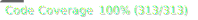

<div style='font-size: 2rem'>@spa-tools</div>

# Interaction Hooks

<!-- Auto-generated Badges Start -->
<span class="badge-npmversion"><a href="https://npmjs.org/package/@spa-tools/interaction-hooks" title="View this project on NPM"></a></span>
<span class="badge-badge"><a href="https://github.com/rollercodester/spa-tools/actions/workflows/test-and-build-packages.yml" title="Test and Build"></a></span>
<span class="badge-badge"><a href="https://github.com/rollercodester/spa-tools/tree/main/packages/interaction-hooks" title="Code Coverage"></a></span>
<!-- Auto-generated Badges End -->

The `@spa-tools/interaction-hooks` package is a small package of specialized hooks meant to solve interaction scenarios in modern React applications.

Feature highlights include:

- Time-saving functionality
- Production-tested
- TypeScript First
- Zero Dependencies
- Tree-shakable

Hooks in this package:

- `useCallOnce`
- `useDetectKeyDown`
- `useInfiniteScroll`
- `useIsHovered`
- `useIsOverflowed`
- `useQueryState`

#### It's highly advised to first checkout the [@spa-tools documentation site](https://rollercodester.github.io/spa-tools/) for a complete list of features, usage scenarios, guidance, and reference.

## Installation

`npm install @spa-tools/interaction-hooks`

## Hooks / Usage

### `useCallOnce`

Hook that ensures code runs once and only once no matter how many times your component re-renders.

```jsx
import { useEffect, useState } from 'react';
import { useCallOnce } from '@spa-tools/interaction-hooks';

// this is the function we want to call only once
function logOnce(message: string) {
  console.log('This will only log once:', message);
}

export function UseCallOnceHookExample() {
  const [time, setTime] = useState(new Date());

  // here we setup some code to force a re-render every second
  useEffect(() => {
    const interval = setInterval(() => {
      setTime(new Date());
    }, 1000);

    return () => clearInterval(interval);
  }, []);

  // here we use the hook to call the function
  // so that it's guaranteed to only execute once
  useCallOnce(logOnce, 'Hello, world!');

  return <p>Current time: {time.toLocaleTimeString()}</p>;
}
```

### `useDetectKeyDown`

Hook that watches for requeste keys/modifiers to be pressed.

```jsx
import { useEffect, useRef } from 'react';
import { useDetectKeyDown } from '@spa-tools/interaction-hooks';

function UseDetectKeyDownExample() {
  // here we wire up a ref for the submit button that we will auto-click
  const submitButtonRef = useRef<HTMLButtonElement>(null);
  // here we ask the hook to set onKeyDownInput1KeyDetected to true
  // when the Shift-Ctrl-P keys are pressed
  const [onKeyDownInput1, pShiftControlKeysDetected] = useDetectKeyDown('P', ['Shift', 'Control']);
  // here we ask the hook to auto-click the submit button when
  // the Enter key is pressed
  const [onKeyDownInput2] = useDetectKeyDown('Enter', submitButtonRef);

  useEffect(() => {
    // we simply alert when the Shift-Ctrl-P keys are detected
    if (pShiftControlKeysDetected) {
      alert('Shift-Ctrl-P detected!');
    }
  }, [pShiftControlKeysDetected]);

  return (
    <div>
      <div>
        <input onKeyDown={onKeyDownInput1} placeholder='Focus here and press Shift-Ctrl-P' />
      </div>
      <div>
        <input onKeyDown={onKeyDownInput2} placeholder='Type something here and press Enter' />
        <button
          onClick={() => {
            alert('Submit button clicked!');
          }}
          ref={submitButtonRef}
        >
          Submit
        </button>
      </div>
    </div>
  );
}
```

### `useInfiniteScroll`

Hook that enables infinite scroll behavior.

```jsx
import { useCallback, useEffect, useRef, useState } from 'react';
import { useCallEndpoint } from '@spa-tools/api-client';
import { useInfiniteScroll } from '@spa-tools/interaction-hooks';

// here we create a custom hook to fetch recipes from a server
// using the useCallEndpoint hook from the @spa-tools/api-client package
function useGetRecipes() {
  return useCallEndpoint(
    'https://dummyjson.com/recipes',
    {
      requestOptions: { recordLimit: 10 },
      serverModelOptions: { jsonDataDotPath: 'recipes' },
    },
    // we pass true to enable appending of new records
    true
  );
}

function UseInfiniteScrollExample() {
  // this will hold the ref to our scroll target, which is just a div that we
  // place below our list of recipes to act as a sentinel for scroll intersection
  const scrollTargetRef = useRef<HTMLDivElement>(null);
  const [total, setTotal] = useState(0);
  const [count, setCount] = useState(0);
  const [getRecipes, recipesResult, isRecipesCallPending] = useGetRecipes();

  // anytime our scroll target is intersected for vertical scroll, the hook
  // will return true, which is how we know to fetch the next page of recipes
  const isScrolling = useInfiniteScroll(scrollTargetRef);

  const handleGetRecipes = useCallback(() => {
    const recordCount = recipesResult?.data?.length ?? -1;
    const totalCount = recipesResult?.total ?? 0;

    setCount(recordCount);
    setTotal(totalCount);

    if (!isRecipesCallPending && recordCount < totalCount) {
      getRecipes();
    }
  }, [getRecipes, isRecipesCallPending, recipesResult?.data?.length, recipesResult?.total]);

  useEffect(() => {
    if (isScrolling) {
      // if the infinite scroll says we're scrolling,
      // then we retrieve the next page of recipes
      handleGetRecipes();
    }
  }, [handleGetRecipes, isScrolling]);

  return (
    <div>
      <h4>
        {count && total ? `${count === total ? `All ${count}` : `${count} of ${total}`} recipes retrieved!` : ''}
        {count && total && count < total ? ' (scroll recipe list to load more)' : ''}
      </h4>
      <div style={{ height: '300px', overflowY: 'auto', padding: '1rem', width: '100%' }}>
        <ul>{recipesResult?.data?.map((recipe) => <li key={recipe.id}>{recipe.name}</li>)}</ul>
        {isRecipesCallPending && <div>Loading recipes...</div>}
        <div ref={scrollTargetRef} />
      </div>
    </div>
  );
}
```

### `useIsHovered`

Hook that watches elements for hover state.

```jsx
import { useRef } from 'react';
import { useIsHovered } from '@spa-tools/interaction-hooks';

function UseIsHoveredExample() {
  // here we simply setup refs to all elements we want
  // to track hover state for
  const buttonRef = useRef<HTMLButtonElement>(null);
  const inputRef = useRef<HTMLInputElement>(null);
  const spanRef = useRef<HTMLSpanElement>(null);
  // yes! you can also track hover state for an array of elements
  const arrayRef = useRef<HTMLButtonElement[]>([]);

  // then we use different hook instances to track the
  // hover state for the above element refs
  const isButtonHovered = useIsHovered(buttonRef);
  const isInputHovered = useIsHovered(inputRef);
  const isSpanHovered = useIsHovered(spanRef);
  const isButtonArrayHovered = useIsHovered(arrayRef);

  const getHoverStateText = () => {
    if (isButtonHovered) {
      return 'Very first button is hovered!';
    }
    if (isInputHovered) {
      return 'Input is hovered!';
    }
    if (isSpanHovered) {
      return 'Text is hovered!';
    }
    if (isButtonArrayHovered) {
      return 'One of the six buttons from cluster is hovered!';
    }

    return 'Nothing is hovered!';
  };

  return (
    <div>
      <div>
        <button ref={buttonRef}>Hover me!</button>
        <input ref={inputRef} value='No, hover over me!' />
        <div>
          Don&apos;t listen to them, hover over{' '}
          <span ref={spanRef} style={{ color: 'purple', cursor: 'pointer', fontWeight: 800 }}>
            this text
          </span>{' '}
          instead!
        </div>
      </div>
      <div>
        <button ref={(el: HTMLButtonElement) => (arrayRef.current[0] = el)}/>Hover</button>
        <button ref={(el: HTMLButtonElement) => (arrayRef.current[1] = el)}/>Over</button>
        <button ref={(el: HTMLButtonElement) => (arrayRef.current[2] = el)}/>Any</button>
        <button ref={(el: HTMLButtonElement) => (arrayRef.current[3] = el)}/>One</button>
        <button ref={(el: HTMLButtonElement) => (arrayRef.current[4] = el)}/>Of</button>
        <button ref={(el: HTMLButtonElement) => (arrayRef.current[5] = el)}/>Us</button>
      </div>
      <h2>{getHoverStateText()}</h2>
    </div>
  );
}
```

### `useIsOverflowed`

Hook that watches for when an element's content is overflowed.

```jsx
import { useRef } from 'react';
import { useIsOverflowed } from '@spa-tools/interaction-hooks';

function UseIsOverflowedExample() {
  const sectionRef = useRef<HTMLDivElement>(null);
  const isVerticallyOverflowed = useIsOverflowed(sectionRef);

  return (
    <div ref={sectionRef} style={{ height: '100vh', overflowY: 'auto' }}>
      <div style={{ height: '200vh' }}>
        <h1>Scroll me</h1>
        <h2>{isVerticallyOverflowed ? 'Overflowed vertically' : 'Not overflowed vertically'}</h2>
      </div>
    </div>
  );
}
```

### `useQueryState`

Hook that manages interaction with the URLs querystring.

```jsx
import { useQueryState } from '@spa-tools/interaction-hooks';

// here we edefine the shape for our query state
interface SortColumnInfo {
  sortColumn: string;
  sortDirection: 'ASC' | 'DESC';
}

function UseQueryStateExample() {
  // we pass true to the useQueryState hook to enable the cache (i.e. localStorage)
  // feature so that the query state for this view is remembered across page reloads
  const { queryState, setQueryState } = useQueryState<SortColumnInfo>(true);

  return (
    <div>
      <div>
        <button
          onClick={() => {
            // here we set the query state to sort by age in descending order
            setQueryState({ sortColumn: 'age', sortDirection: 'DESC' });
          }}
        >
          Sort by Age (DESC)
        </button>
        <button
          onClick={() => {
            // here we set the query state to sort by name in ascending order
            setQueryState({ sortColumn: 'name', sortDirection: 'ASC' });
          }}
        >
          Sort by Name (ASC)
        </button>
        <button
          onClick={() => {
            // here we hard reload the page with querystring removed
            // to test the cache feature
            window.location.href = window.location.href.split('?')[0];
          }}
        >
          Hard reload to test cache
        </button>
        <button
          onClick={() => {
            // here we clear the query state
            setQueryState(null);
          }}
        >
          Clear sort settings
        </button>
      </div>
      <div>
        {queryState === null ? (
          `Click one of the "Sort by" buttons and watch the browser's URL and also how this text changes!`
        ) : (
          <span>
            Sort column <strong>{queryState.sortColumn}</strong> in <em>{queryState.sortDirection}</em> direction!
          </span>
        )}
      </div>
    </div>
  );
}
```

## Docsite

View the [@spa-tools documentation site](https://rollercodester.github.io/spa-tools/) for complete reference.

## Motivation

All real-world SPAs have to deal with configuration, typcially having to manage settings that vary across mutliple environments. The defacto approach to solve this problem has been to use multiple .env files using a package such as _dotenv_, which in its own right is a fantastically proven package.

And while it's true that the static dotenv flow has been standardized for quite some time now, it typically involves maintaining build scripts in lockstep with devops pipelines to ensure that pseudo environment-variables are available to your SPA across respective environments. Let's be honest, this can become a bit of a headache and arguably, pseudo-env-vars can feel yucky in frontend code.

As such, I started using the runtime-config pattern in SPAs a few years back and have not looked back, since.


## Contributing

If you're interested in contributing to @spa-tools, please first create an issue on the [@spa-tools monorepo in GitHub](https://github.com/rollercodester/spa-tools)
or comment on an already open issue. From there we can discuss the feature or bugfix you're interested in and how best to approach it.
In terms of workflow, we use the standard approach of forking the repo, creating a PR, and merging after tesing/approval.

### Unit Test Coverage

All packages in @spa-tools require 100% unit test coverage. This is a condition for all PRs to be merged whether you're adding a new feature or fixing a bug.

The only exception is when native code is being wrapped and coverage is either not possible or redundant, which can be discussed on a case-by-case basis
during the approval process.

## License

All packages in @spa-tools are licensed under the [MIT](https://en.wikipedia.org/wiki/MIT_License) license. Copyright © 2024, Ryan Howard (rollercodester). All rights reserved.
