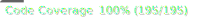

<div style='font-size: 2rem'>@spa-tools</div>

# Runtime Config

<!-- Auto-generated Badges Start -->
<span class="badge-npmversion"><a href="https://npmjs.org/package/@spa-tools/runtime-config" title="View this project on NPM"></a></span>
<span class="badge-badge"><a href="https://github.com/rollercodester/spa-tools/actions/workflows/test-and-build-packages.yml" title="Test and Build"></a></span>
<span class="badge-badge"><a href="https://github.com/rollercodester/spa-tools/tree/main/packages/runtime-config" title="Code Coverage"></a></span>
<!-- Auto-generated Badges End -->

The `@spa-tools/runtime-config` package is a modern, hands-off alternative to the old approach of using .env files. With the Runtime Config you don't have to worry about devops scripts because the correct environment config is automatically available at runtime. And now you know how the package name came about :-).

#### Feature highlights include:

- Centralized Config
- Runtime Detection
- Minimalist Options
- Obfuscation (optional)
- TypeScript First
- Zero Dependencies
- Tree-shakable

## Quickstart

#### It's highly advised to first checkout the [@spa-tools documentation site](https://rollercodester.github.io/spa-tools/) for a complete list of features, usage scenarios, guidance, and reference.

### Installation

`npm install @spa-tools/runtime-config`

### Usage

```ts
import { BaseConfigSettings, DomainConfig, RuntimeConfig } from '@spa-tools/runtime-config';

// here we're using Typescript to define a type for our environment names
// but you can skip all type defs if you're using plain JS
type MyAppEnvironments = 'development' | 'staging' | 'production';

// likewise, we define a type for our app's runtime config settings
interface MyAppConfigSettings extends BaseConfigSettings<MyAppEnvironments> {
  authClientId: string;
  authUserPoolId: string;
  loggerClientId: string;
  loggerUrl: string;
  myAppApiUrl: string;
}

//
// here we define our environment domain-config by mapping our app domain names
// to our respective environment settings
//
// you may notice that there is one additional property in the domain-config
// named "environment" and this is required, which is why MyAppConfigSettings
// extends BaseConfigSettings.
//
const myAppConfigSet: DomainConfig<MyAppConfigSettings> = {
  //
  // development environment settings (based on domain name)
  //
  'myapp.dev.com': {
    authClientId: 'auth-client-id-dev',
    authUserPoolId: 'user-pool-id-dev',
    environment: 'development',
    loggerClientId: 'logger-client-id-dev',
    loggerUrl: 'https://dev.loggingservice.com',
    myAppApiUrl: 'https://api.dev.myapp.com',
  },
  //
  // staging environment settings (based on domain name)
  //
  'myapp.stg.com': {
    authClientId: 'auth-client-id-stg',
    authUserPoolId: 'user-pool-id-stg',
    environment: 'staging',
    loggerClientId: 'logger-client-id-stg',
    loggerUrl: 'https://stg.loggingservice.com',
    myAppApiUrl: 'https://api.stg.myapp.com',
  },
  //
  // production environment settings (based on domain name)
  //
  'myapp.com': {
    authClientId: 'auth-client-id-prod',
    authUserPoolId: 'user-pool-id-prod',
    environment: 'production',
    loggerClientId: 'logger-client-id-prod',
    loggerUrl: 'https://loggingservice.com',
    myAppApiUrl: 'https://api.myapp.com',
  },
  //
  // finally we define settings for when our app is running locally
  //
  // notice that we still consider local our "development" backend
  // environment but we could map it to any environment we wanted
  //
  localhost: {
    authClientId: 'auth-client-id-dev',
    authUserPoolId: 'user-pool-id-dev',
    environment: 'development',
    loggerClientId: 'logger-client-id-dev',
    loggerUrl: 'https://dev.loggingservice.com',
    myAppApiUrl: 'https://api.dev.myapp.com',
  },
};

//
// here we initialize the runtime config object, utilizing Typescript generics so
// we get the goodness of intelisense when accessing the config in our app
//
export const myAppRuntimeConfig = RuntimeConfig.initialize<
  MyAppConfigSettings,
  MyAppEnvironments
>(
  myAppConfigSet
);

//
// now we can access our runtime config object in our app, which will automatically
// return the settings for the environment our app is running in
//

console.log('What is the current environment context?');
console.log(myAppRuntimeConfig.settings.environment);

console.log("What is MyApp's current API URL?");
console.log(myAppRuntimeConfig.settings.myAppApiUrl);

console.log("Let's use the isRunningLocal property to check if we are running locally...");
if (myAppRuntimeConfig.isRunningLocal) {
  console.log('We are indeed running locally!');
} else {
  console.log('We are NOT running locally!');
}

console.log("Let's just log the entire runtime config object for good measure...");
console.log(myAppRuntimeConfig);
```

## Docsite

View the [@spa-tools documentation site](https://rollercodester.github.io/spa-tools/) for complete reference.

## Motivation

All real-world SPAs have to deal with configuration, typcially having to manage settings that vary across mutliple environments. The defacto approach to solve this problem has been to use multiple .env files using a package such as _dotenv_, which in its own right is a fantastically proven package.

And while it's true that the static dotenv flow has been standardized for quite some time now, it typically involves maintaining build scripts in lockstep with devops pipelines to ensure that pseudo environment-variables are available to your SPA across respective environments. Let's be honest, this can become a bit of a headache and arguably, pseudo-env-vars can feel yucky in frontend code.

As such, we began using a similar runtime config pattern in SPAs a few years back and have not looked back, since.

## Contributing

If you're interested in contributing to @spa-tools, please first create an issue on the [@spa-tools monorepo in GitHub](https://github.com/rollercodester/spa-tools)
or comment on an already open issue. From there we can discuss the feature or bugfix you're interested in and how best to approach it.

### Unit Test Coverage

All packages in @spa-tools require 100% unit test coverage. This is a condition for all PRs to be merged whether you're adding a new feature or fixing a bug.

## License

All packages in @spa-tools are licensed under the [MIT](https://en.wikipedia.org/wiki/MIT_License) license. Copyright © 2024, Ryan Howard (rollercodester). All rights reserved.
